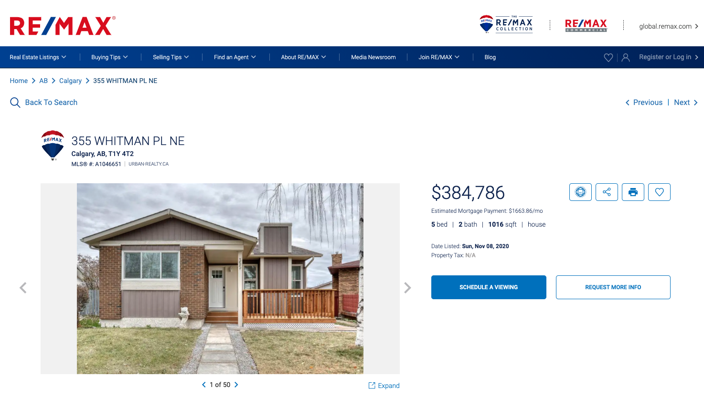
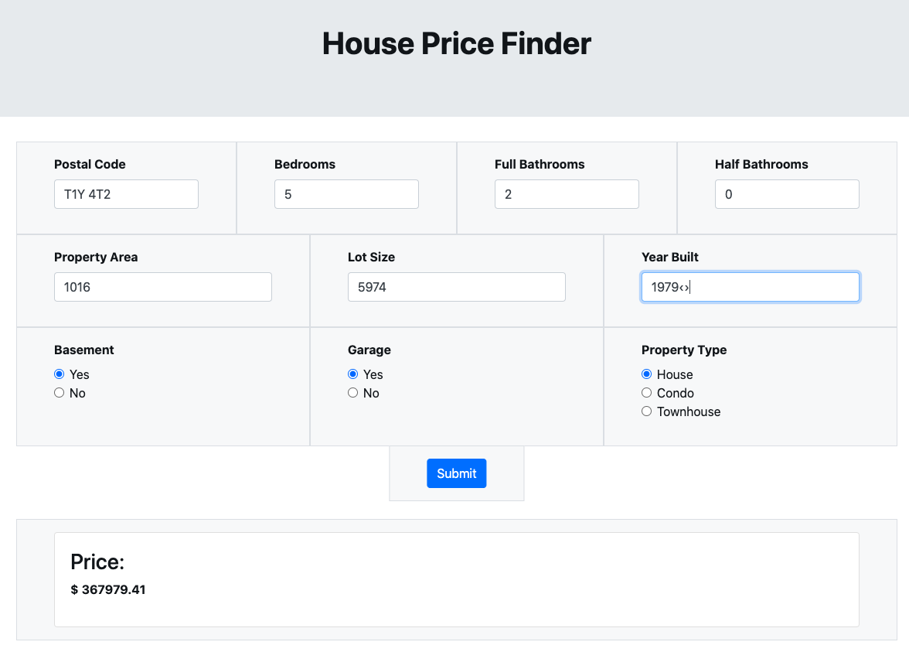
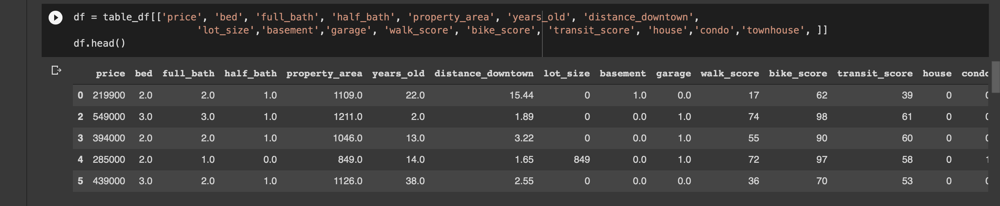
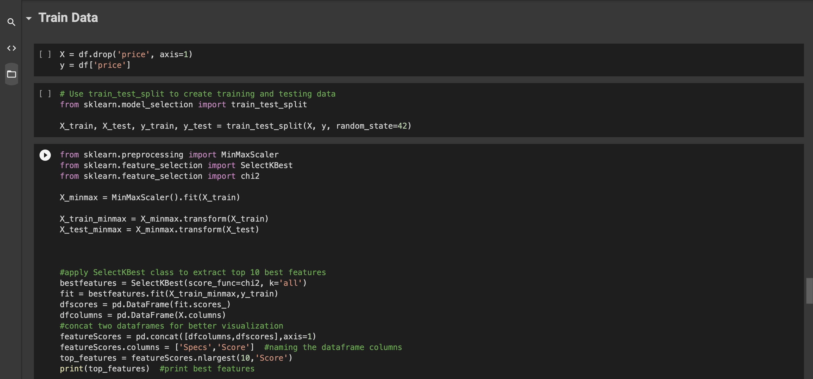
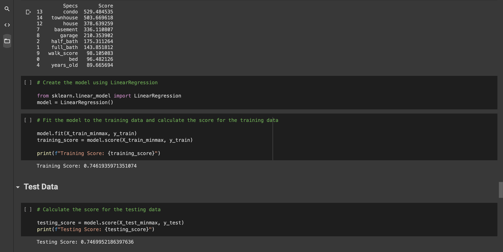
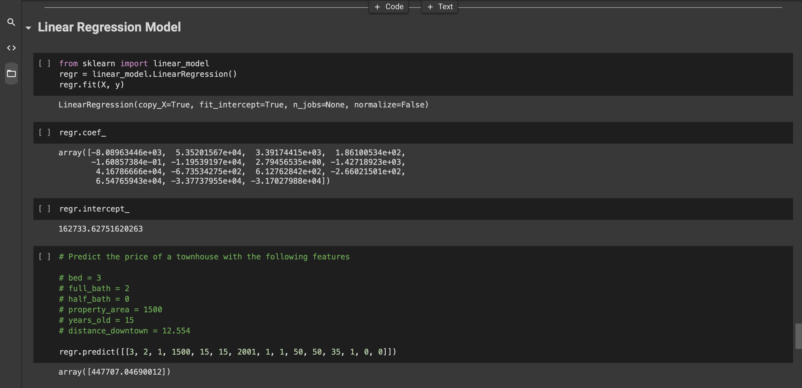
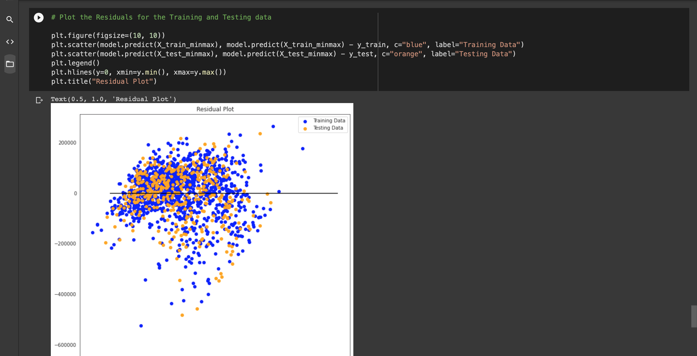
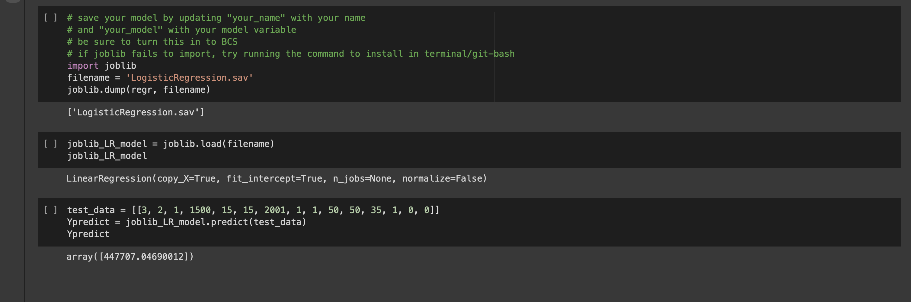

# ML_Project

The machine learning model created for our Real Estate/Walk Score project can predict the price of a house in Calgary, AB, based on a variety of features. 

# ML Page

As you can see above, based on the values inputted, the model was able to accurately predict the price of the listing posted.

# Scikit-Learn ML library used to train data and create linear regression model

# Connected app to Heroku for serverless viewing

